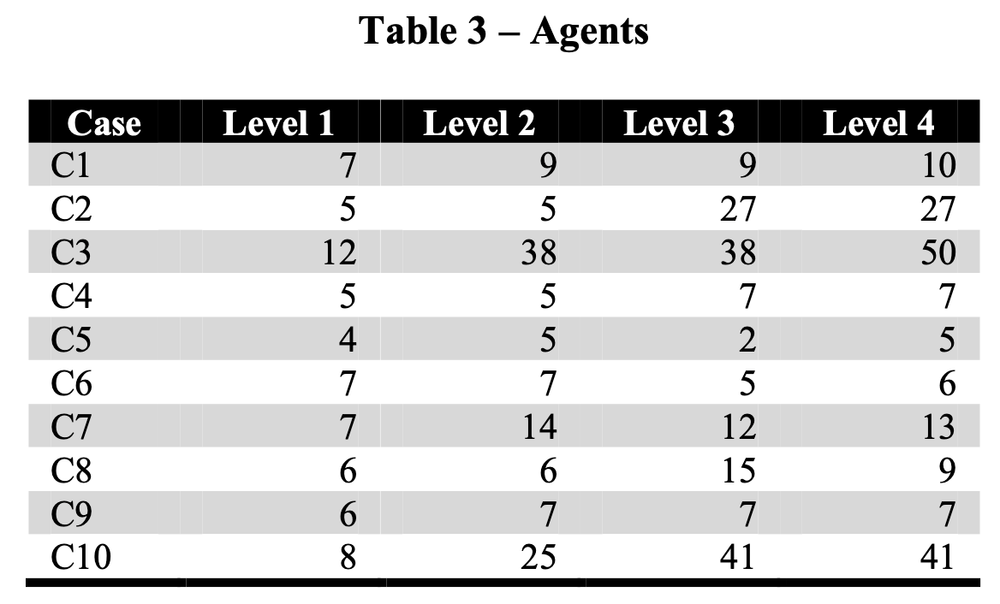
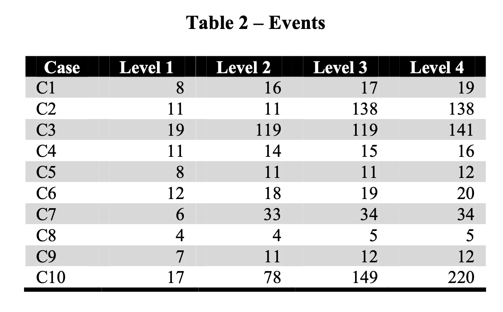
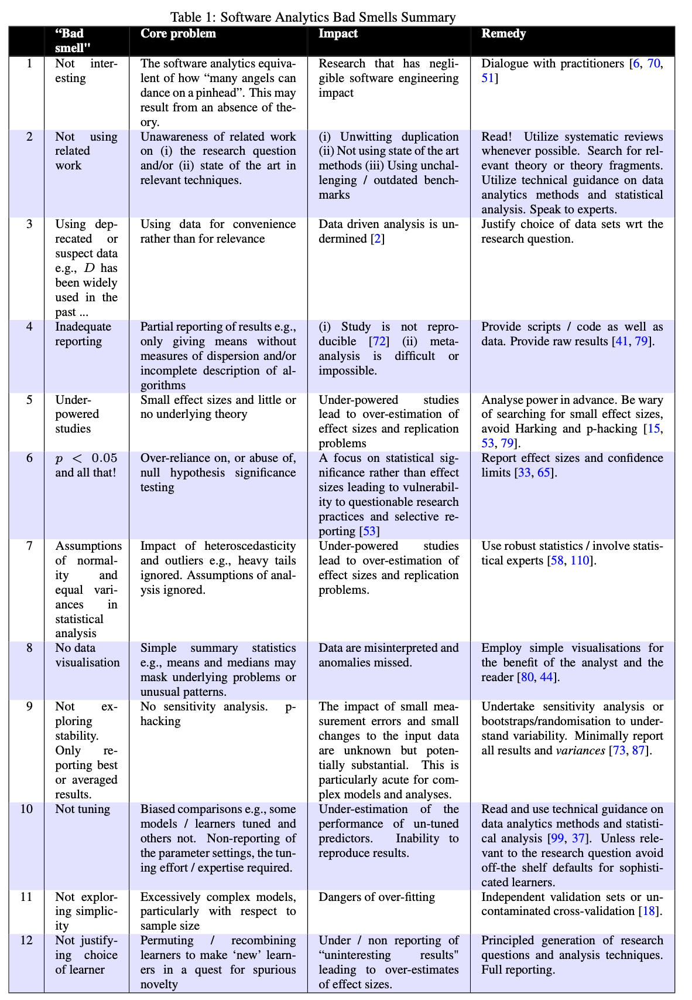

# Dataset Challenges in SE Data Science

What are the data sources? 
## Learning Objectives
1. Understand sources of software data.
2. Model the chance of finding an effect of interest.
3. Explore the limitations of software datasets.
4. Categorize sources of error in software research.

----

* Commits
* Issue trackers
* Source code
* Structured data 
* Stack Overflow
* 
----

# What are some challenges? 
1. Using the data that is available, instead of the data that answers the question.
2. Ignoring domain assumptions that produced the data, e.g. the human aspects (Secret Life of Bugs)
3. Sampling opportunistically (convenience) instead of systematically.
4. Not understanding the sensitivity of your instrument (the Kangaroo problem)
5. Questionable research practices

----
One of the biggest problems - and best places to spend money - is **getting good data**. The most obvious example of this is building big telescopes or high energy physics instruments. 

Too often we go and use grad students to do a task instead of spending more time getting professionals. If you are looking for a small effect, you need to have a precision instrument! 

----
# Power Analysis
* Power is the probability before a study is done that it will achieve statistical significance for $\alpha < 0.05$ (or other values).
* First, we guess an "effect size" for our test (e.g., difference of means), then guess at sample size and variation.
* Most funders would expect studies to have power > 80%.
* Power analysis is inherently exploratory and hypothetical - simulation can help.
* What about study costs? Maybe it is cheap to collect data. 
* See Fig 16.1 of Regression and other stories.

----

----
# Noisy data
* when noise is high and signal is low,  statistically significant results are unlikely to replicate.
* type M - magnitude and type S - sign errors more likely in low-powered studies
* Best approach is to design a study to maximize effect size rather than population
* E.g., look at groups more likely to respond, increase treatment amounts
* Everything has an effect!

----
# Effect sizes (briefly)
* Connect statistical outcomes (difference of means) to real-world impact -- **practical significance**.
* E.g. Cliff's D, R^2 (explained variance), Cohen's d, etc. 
* Section 2.3 of my [paper](https://arxiv.org/pdf/1809.09849.pdf)
> "effect size ignores the context of decision making. A raw number reflecting (for example) the standardized difference of means is hard for practitioners to interpret and must be contextualized.
> contextual, subjective judgment of observed effect sizes must be made and a ritualized interpretation avoided
* Bayesian analysis would implicitly ask us to do this: what effect is substantive? (avoid the golem!)

----
# Secret Life of Bugs
What is the "secret"?
> The histories of even simple bugs are strongly dependent on social, organizational, and technical knowledge that cannot be solely extracted through automation of electronic repositories

## Levels
1. Bug record data: bug tracker, resolution, people involved, commits associated
2. Automated conversation analysis: examining comments
3. Sense-making by informed observer
4. Direct narrative reports by participants

----
# Stark differences in data available

----
# Sampling 
1. For many SE phenomena, there is **no suitable sampling frame**; that is, a list from which to draw a sample.
2. Some SE studies adopt poorly understood sampling strategies such as random sampling from **a non-representative surrogate population**.
3. Many SE articles evince **deep misunderstandings of representativeness**—the key criteria for assessing sampling in positivist research (see Section 2.6).

----
# Sampling Approaches
1. Convenience
2. Purposive
3. Snowball
4. Probabilistic (random)
   1. Simple
   2. Stratified

----
# Sampling Challenges
1. Finding a representative sample: representativeness is the degree to which a sample’s properties (of interest) resemble those of a target population
2. Randomness is not sufficient
3. Some philosophies do not view representativeness as desirable or relevant.
4. Software people are expensive
5. Real data is often under NDA
6. Software projects cover a vast universe of domains and contexts
7 ... (crowd sourcing anecdote)

----
# Bad Smells in Software Samples
– Incorrectly using the term “random” to mean arbitrary.
– Arguing that a convenience sample of software projects is representative because they are “real-world” projects.
– Assuming that a small sample is representative because it is random.
– Assuming that a large random sample is representative despite being selected from an obviously biased sampling frame.
– Implying that results should generalize to large populations without any claim to having a representative sample.
([Baltes and Ralph](https://arxiv.org/pdf/2002.07764.pdf))

----
# Exercise
Design a sampling strategy for the inferential question we considered earlier, i.e.
> (1) You are the manager of 10 teams at Spotify doing software development. Each team uses their own tools; some use Slack, others use email and IRC. Is there a connection between Slack use and team reported productivity?

and

> (2) You are looking to see how many bugs exist in primarily machine-learning software (e.g., building and training ML models with Tensorflow) vs other types of software

----
## Data Analytics Methodology Problems

----
1. Not interesting
2. Not using related work
3. Deprecated or suspect data
4. Inadequate Reporting
5. Underpowered
6. Emphasizing p-values
7. Misunderstanding data distributions
8. No visualization
9. No stability analysis
10. Not tuning
11. Over complicating
12. No rationale for learner choice
   
See also [ACM SigSOFT Empirical Review Standards](https://github.com/acmsigsoft/EmpiricalStandards)

----
# Git Promises and Perils
- **promises**: analysis Git enables
- **perils**: dangers with relying on Git
*in general: the data we see may not be an impartial log of events*
- Git new on the scene at the time (replacing SVN/CVS)
- Git is distributed
- Git histories can be cleaned
  - delete/omit commits, squash / condense commits into one
  - lose the rich history of how a change was arrived at (Tesla example)
- Git branches are potentially confusing 
----
# Github Promises and Perils
- Daniel's Venn diagram of Github projects, public, useful
- Repos =/= project (forks for PRs)
- Many projects inactive or uninteresting
- Some repos are for data storage or personal use
- PRs used in different ways.
* PRs don't record all commits.
* Most pull requests appear as non-merged even if they are actually merged.
* Many active projects do not conduct all their software development in GitHub

----
## Other Challenges
- temporal pollution
- [likes and stars](https://www.sciencedirect.com/science/article/pii/S0164121218301961)
- bots
- gender and demographics

