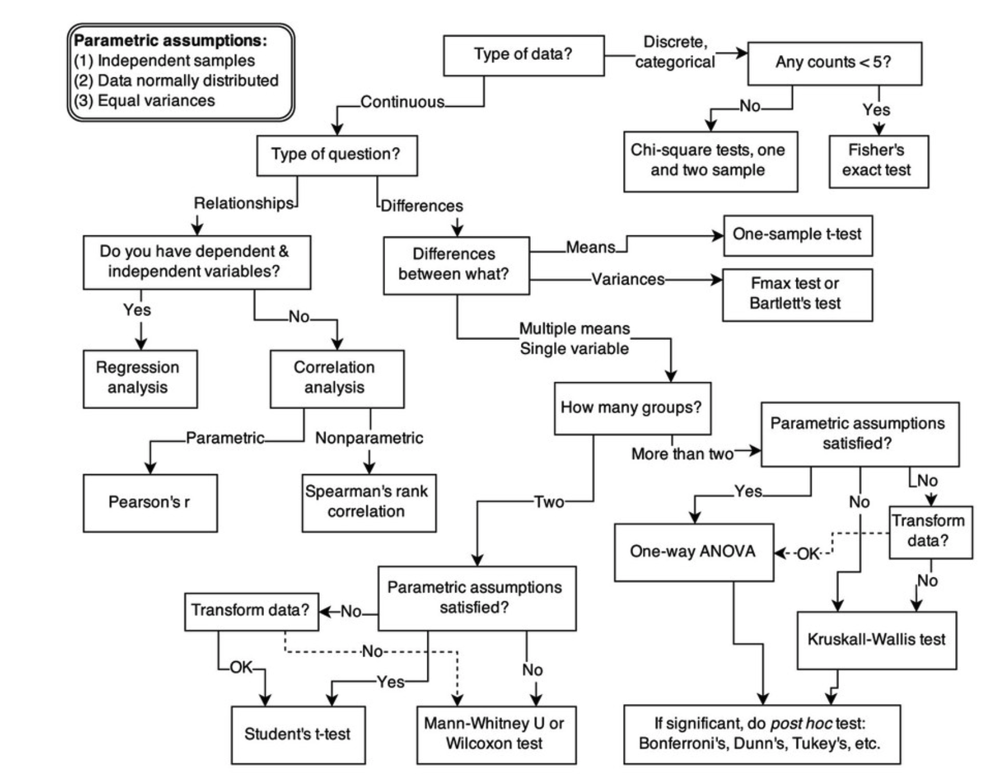

# Introduction

(Mostly based on McElreath's [book](https://learning-oreilly-com.ezproxy.library.uvic.ca/library/view/statistical-rethinking-2nd/9780429639142/xhtml/10_Chapter02.xhtml))

McElreath has this notion of *golem*, essentially a mechanical device that for a given input produces some statistical test output. In our world these are the *models* we work with. 

For example, if I have two sample populations with mean $$x_i$$ and $$x_j$$, variance $s_i,s_j$, then my golem might tell me to use a t-test to compare the means. And importantly (hence the golem metaphor) without any awareness of what the inputs are, and especially with no idea if that is the right golem to use for the problem. Thus we should be very careful when relying only on statistical tests, as their results may not be accurate.

----

# Bayesian Data Analysis

> Count all the ways data can happen under the assumptions. Assumptions with more ways the data can happen are more plausible.

Model plausibility: instead of falsifying some (often arbitrary and unrealistic) null hypothesis model (e.g., programming skill has NO EFFECT on task time), compare credible models (or hypotheses). Which one best describes the data? 

* Watch for overfitting - if we train on the data, the model knows the **sample** really well, but not the broader **world** (which is what we care about!)
* Use information theory ([AIC](https://en.wikipedia.org/wiki/Akaike_information_criterion), cross-validation)

Marbles example

