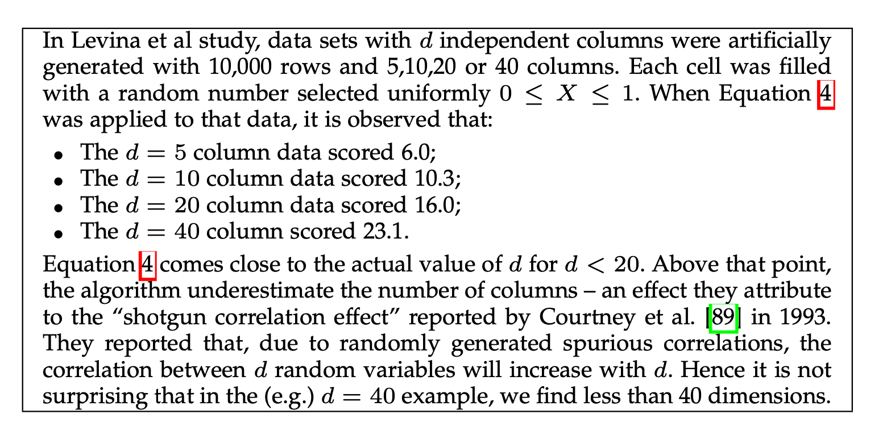
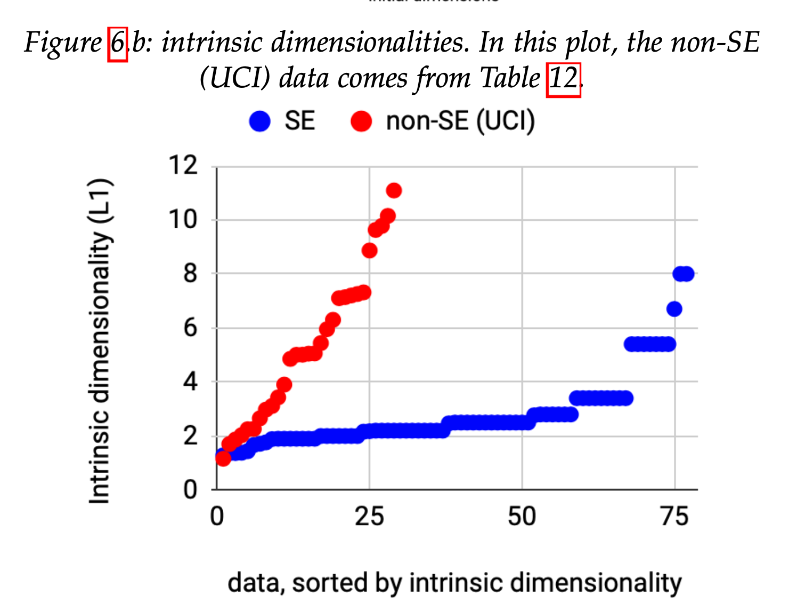
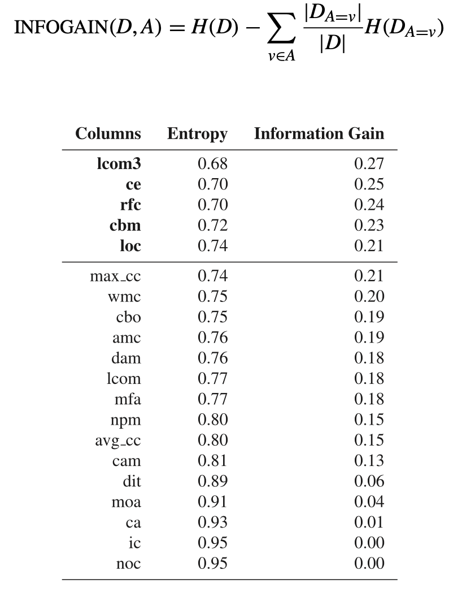

This is an [R Markdown](http://rmarkdown.rstudio.com) Notebook. When you execute code within the notebook, the results appear beneath the code. 

``` {r load tidy}
library(tidyverse)
library(foreign)

```


# Data Exploration

(A lot of this material is from [R for Data Science](https://r4ds.had.co.nz/), a freely available book)


One of the first tasks is to better understand the data. We looked at that in the Bayesian context from the *epistemological* and *ontological* perspectives: how we think the data were created, and what properties exist in our data. 

Often that means background reading, e.g., a literature review or domain modeling. What are your intuitions about how the data would be generated, e.g., for job application information?

----

Next, take the data and get it loaded into R or Jupyter. My favourite toolset is the [`Tidyverse`](https://www.tidyverse.org/), a set of libraries and philosophies for manipulating R data frames.

Loading data is initially easy but quickly becomes a major challenge as data gets larger and more complex. A non-trivial amount of effort can be spent wrangling data into the correct format. A big part of TidyR is to get the data into a "shape" that is easy to work with.

Let us consider the following datasets: http://promise.site.uottawa.ca/SERepository/datasets-page.html. They are mostly in a common data exchange format called ARFF. 

``` {r}
jm1 = read.arff("http://promise.site.uottawa.ca/SERepository/datasets/jm1.arff")
jm1 <- as_tibble(jm1)
```

----

## Loading Data - Tibbles

We can begin by (after reading the dataset description) looking at common **descriptive** properties of the data.

Use R's `$` column notation to explore each column. 

Tidy Data: 

1. Each variable must have its own column.
2. Each observation must have its own row.
3. Each value must have its own cell.

Factors: factors are categorical data, possibly ordered, like "letter grade" (ordered) or country name.

Let's say we are interested in how well Halstead complexity `v(g)` predicts defects. 

----

### Filtering and aggregating

In Tidyverse language, use the TidyVerse chaining operator %>% (pipe) to group operations on dataframes/tibbles.

Useful operations include `mutate`, `filter`, `summarize/group_by`. I find these operations extremely powerful for manipulating the data. You can think of them as data frame analogues for SQL query statements. 

I suggest you load your data into a data frame and then chain filters into it, rather than "fixing" the dataset in a separate step. That way you get to see all the data wrangling in one place. It can be *really* easy to miss a step and end up with outliers that are included, aggregations that don't make sense, etc.

``` {r tibble} 
jm1 = jm1 %>% mutate(norm = i / loc)
as.factor(jm1$defects) #(but should be logical)
jm1 %>% count(defects)
ggplot(data = jm1) +
  geom_point(mapping = aes(y=`v(g)`, x=defects))
jm1 %>% filter(loc > 1000) %>% select(`v(g)`)
```

----

## Probability distributions and fit 

the ``ggplot()`` library in R (and MatPlotLib in Python) are best in class visualization approaches with a vast amount of options and when combined with the filtering/aggregating, can do almost anything. 

Use ggplot to explore your data and dimensionality as we showed in the R walkthru. Don't feel bad about using SO or references; I did preparing this tutorial! 

Visualization can help understand what is happening. Descriptive stats such as mean, median, variance can give some numeric information conditional on the distribution involved. These are typically generalized as **location** and **dispersion**, e.g., where the big clump of data lives in the normal, and how spread out it is.

``` {r binning}
sum <- jm1 %>% summarise(count = n(), loc_m = mean(loc), loc_med = median(loc), loc_sd = sd(loc))
binned <- jm1 %>% mutate(bin = cut(loc, 4,c("small", "medium", "large", "giant")) )
binned %>% group_by(bin) %>% summarise(count = n(), med = median(loc))
# show distributions
ggplot(data = binned, mapping = aes(x=loc,y = ..density..)) + 
  geom_freqpoly(mapping = aes(colour = bin), binwidth=100)
ggplot(data = binned, mapping = aes(x = bin, y = `v(g)`)) + 
         geom_violin()

```

----

### Correlation

Thinking back to our causal models, some of the variables are correlated, possibly causally. We should look for correlation because it is a great source of confusion; either implying some effect that is really due to a hidden mediator, or making us run extra analyses that are all based on the same underlying mechanism.

``` {r correlation}
ggplot(binned, aes(x=loc, y = `v(g)`)) + geom_point() + geom_smooth(method=lm)
ggplot(binned, aes(sample= `v(g)`)) + geom_qq_line() + geom_qq()
# correlation is the covariance normalized by standard deviations to normalize from -1 to 1
```

 We can use QQ plots (quantile-quantile) to examine fit to a distribution. The distribution's known shape is the central line and the actual data fit is the dots.

We can also use 
``` {r}
library(corrplot)
cor_loc <- cor(binned$loc, binned$`v(g)`)
corrplot(cor(jm1[, 1:10]))
```
as a rough approximation of correlation. Remember to plot the data first, to see what the numbers are telling you. 

----

# Dimensionality Reduction
One challenge with datasets with lots of dimensions (variables/features/columns) is that running algorithms gets worse. For example, if we have an algoritym like nearest neighbours with a distance function, the distance function will perform very poorly in high-dimension spaces (the curse of dimensionality).

The good news is we believe, empirically, that most SE data has low inherent dimensionality. This is important since, as Fisher points out, 
> Further advances in advanced software analytics will be
stunted unless we can tame their associated CPU costs.

## Compare SE datasets to UCI
- SE data often binary labels and imbalanced
- SE data have lower intrinsic dimensionality

 


See 10.1109/TSE.2021.3073242

## So What To Do?

1. Do less parameter tuning: the data are simpler, so you do not need thousands of trials. But as data has more dimensionality, the SE specific learners will be less effective.
2. Share less data: drop the individual data points and look at representatives or clusters (e.g. the centroid).
2. Reduce the excess dimensionality of SE datasets

## Principle Components Analysis
In some cases you can just do a correlation  analysis and chuck predictors that are correlated. For example, flag each column with `USE?` and explore how well each one helps the AIC score. Problem: exponential! Better: do a search through feature space. E.g. with PEEKING2:



PEEKING2 is a search algorithm that relies on a variant of PCA, which tries to find the principle components which capture the most variance in the data

``` {r pca} 
jm1.pc <- prcomp(jm1[c(1:10)], center = TRUE, scale = TRUE)
summary(jm1.pc)
```

And we can see that PC1 contains 63% of the variance, PC2 contains 11%, etc. Thus the variance in our 10 columns has been reduced to 3-4 principle components.

```{r vis-pca}
library(ggfortify)
autoplot(jm1.pc, data = jm1, colour = 'defects')
```
This plot shows us the first 2 components with the associated labels. We don't see any obvious separation here.

# Regression
A useful approach, which we covered in Assignment 1, is to do a simple linear regression. In the simplest sense this is about finding the line that best fits the data. Extending the line to unseen datapoints is a *prediction* about what the y value should be for that data. 

Ordinary least squares (OLS) regression is possible when there is a simple relationship to plot. It looks something like:
$$ y_i = \beta x_i + \alpha + \epsilon_i$$
And our task is to find $\alpha, \beta$ to minimize the (squared) error in our estimated $\hat{y}$, i.e. the value $y_i - \hat{y}$ for all the $y$s. If we think about y as predicting individual height h, we can simply say your height is some intercept $\alpha$ and an error term.

This has a precise (algebraic) solution. 

This is the alternative representation of the Gaussian model we can represent in Stan/Rethinking: 

$$ y_i \sim \mathcal{N}(\mu, \sigma) \\
\mu \sim  Normal(param, param) \\
\sigma \sim Uniform(param, param)
$$

(I generally prefer the latter)

The generalized version of this is a *generalized linear model* or GLM, and accounts for things like how the data and the marginals (the error) are distributed, as we saw in A1. 

R has a built in GLM approach that is frequentist:

``` {r}
fit <-  glm(defects ~ ., data=jm1, family=binomial)
summary(fit)
```

You might say "the outputs of both of these approaches are very similar" and thus, who cares if it is frequentist. Pragmatically I suppose that is true but you can get into trouble in the edges. In some sense we would hope that two different inferential approaches will find the *same* outcomes, if that outcome is a real thing. 

| Bayes | Frequentist |
| ---- | ----|
| Prior captures past knowledge | Assumption of ignorance about past |
| Sample from likelihood | Maximum likelihood estimation (MLE) | 
| Computationally more costly | Cheap | 
| Posterior represents probability of the parameter being true | p-value captures likelihood of observing data as extreme under null hypothesis |

<!-- From a Bayesian point of view we can use the convenient `rstanarm` library: -->

<!-- ```{r bayesian glm} -->
<!-- library(rstanarm) -->
<!-- options(mc.cores = parallel::detectCores()) -->
<!-- fit_1 = stan_lm(defects ~ loc , data = jm1, family=binomial) -->
<!-- print(fit_1) -->
<!-- ``` -->

One problem is that a model with 8 datapoints is perfectly explained by 8 variables. This overfitting issue can occur in regression as well, if we have models - like this jm1 dataset - with many variables. It also makes interpretation harder, as we have to explain the outputs based on more of these inputs. Thus we might penalize the regression model to prevent overfitting and reward simpler models. Two such approaches are *ridge* and *lasso* regression. In ridge regression we penalize the $\beta$ parameter above and seek to minimize the error AND the penalty; in lasso (least absolute shrinkage and selection operator) the penalty acts to see which coefficients can be forced to 0 (and discarded). This creates a sparser model; our error will probably be higher, but the explainability and generalizability should be increased.

Scikit-learn has a [nice Python explanation of this problem](https://scikit-learn.org/stable/auto_examples/inspection/plot_linear_model_coefficient_interpretation.html#linear-models-with-sparse-coefficients). 

----

# Unsupervised Stuff

We have been working on problems where we have columns X and labels Y. But what if we only have X? This is 99% of the adata in the world, of course, annoying CAPTCHAs notwithstanding.

Unsupervised learning is about finding relationships between the Xs (sort of like PCA was doing). One simple approach is to ask, can I cluster my data points into (N-dimensional) groups, such that a point $m$ is in cluster $J$ iff there is no closer cluster? This assumes "distance" in vector space means similarity in the real world, of course. 

One useful library for doing this, aside from the builtin libraries in Scikit-learn and R, is [Weka](https://www.cs.waikato.ac.nz/ml/weka/). 
 
----

# Supervised Stuff
Now let's say we have Y (the labels / ground truth) and want to partition our data so we maximize the accuracy with which we label the instances.

There's a long list of approaches to this problem (so-called shallow learning): decision trees, support vector machines, etc.


I like Weka for exploration but for bigger datasets and more extensive experimentation, the command line or a notebook (hence usually Python) is best. Aside: SAVE YOUR EXPERIMENTS! Always record the steps and params you chose for a given exploration. It will save you headaches later.

## Confusion Matrices
If we have two labels, True and False, then our task is to correctly predict the label for a given instance. When we do that on all the data instances, we get a set of correctly labeled instances (true positives and true negatives) and a set of incorrectly labeled instances (false positives/negatives). Our general task is to create a 

```
%    -- Defect detectors can be assessed according to the following measures:
%
%                                                module actually has defects
%                                               +-------------+------------+
%                                               |     no      |     yes    |
%                                         +-----+-------------+------------+
%          classifier predicts no defects |  no |      a      |      b     |
%                                         +-----+-------------+------------+
%        classifier predicts some defects | yes |      c      |      d     |
%                                         +-----+-------------+------------+
%
%        accuracy                   = acc          = (a+d)/(a+b+c+d
%        probability of detection   = pd  = recall = d/(b+d)
%        probability of false alarm = pf           = c/(a+c)
%        precision                  = prec         = d/(c+d)
%        effort                     = amount of code selected by detector
%                                   = (c.LOC + d.LOC)/(Total LOC)
%
%        Ideally, detectors have high PDs, low PFs, and low
%        effort. This ideal state rarely happens:
```
My favorite, most comprehensive guide is [from Wikipedia](https://en.wikipedia.org/wiki/Confusion_matrix)

Some other common metrics include:

* ROC - AUC (and the curve itself)
* Matthews Correlation Coefficient

These can all be implemented using library calls. The ROC curve metric is pretty 
The key is to understand what you are aiming to optimize. In some cases, like assessing ambiguous requirements, 100% recall is better than improved precision. 

Another key is to **have a valid baseline**. This might be ZeroR, the classifier that predicts the majority class; a random classifier; or the current SOTA (state of the art). 


# Hyper-parameters
If we have X and Y (columns and labels) we can also think about a third set, Z, which constitutes the parameters for our classifiers and clusterers. We might also want to find an effective Z. Hyper-parameter optimization searches for optimal parameters for the learners. How should we do this search? Remember that SE data is usually pretty simple. Optimization can be very effective.

----

# Optimization

The simplest approach: GATE

**G** enerate  from data, priors, fuzzing

**A** ssess how well that approach works, quickly 

**T** ry (**e**valuate, maybe slow e.g. ask a human)

https://github.com/txt/ase19/blob/master/docs/optimize.md#top

----

# Active Learning and Weakly Supervised Learning
Generating labels is expensive. Usually it invovles human annotators; often it is messy and ambiguous. 

**Active Learning** asks us to label a smaller set of instances that are closer to a decision boundary, e.g., the images that look somewhat like a cross-walk but also somewhat like a fence. 

**Weakly Supervised** learning (aka Few Shot learning) tries to do a lot with few initial labels.

----

## Genetic Algorithms

- NSGAII
- Diff Evolution 

[JMetal](https://jmetal.github.io/jMetal/) 

